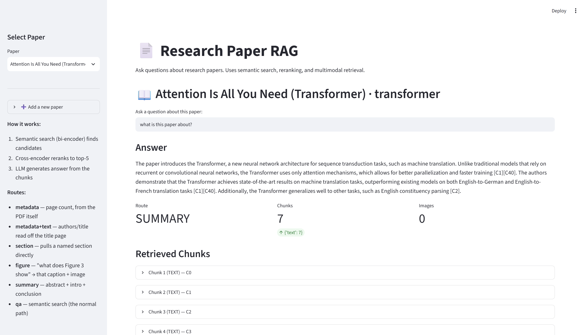
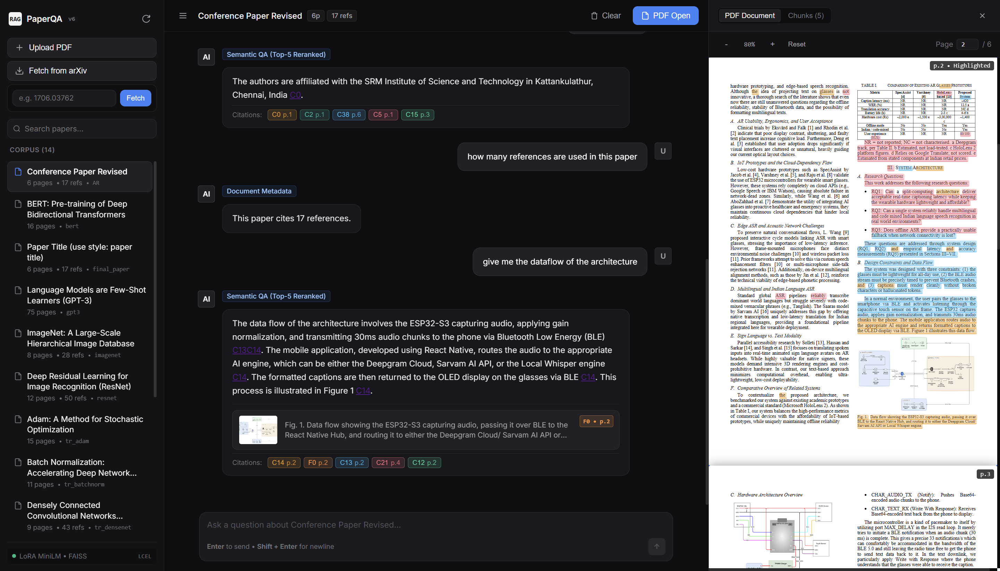
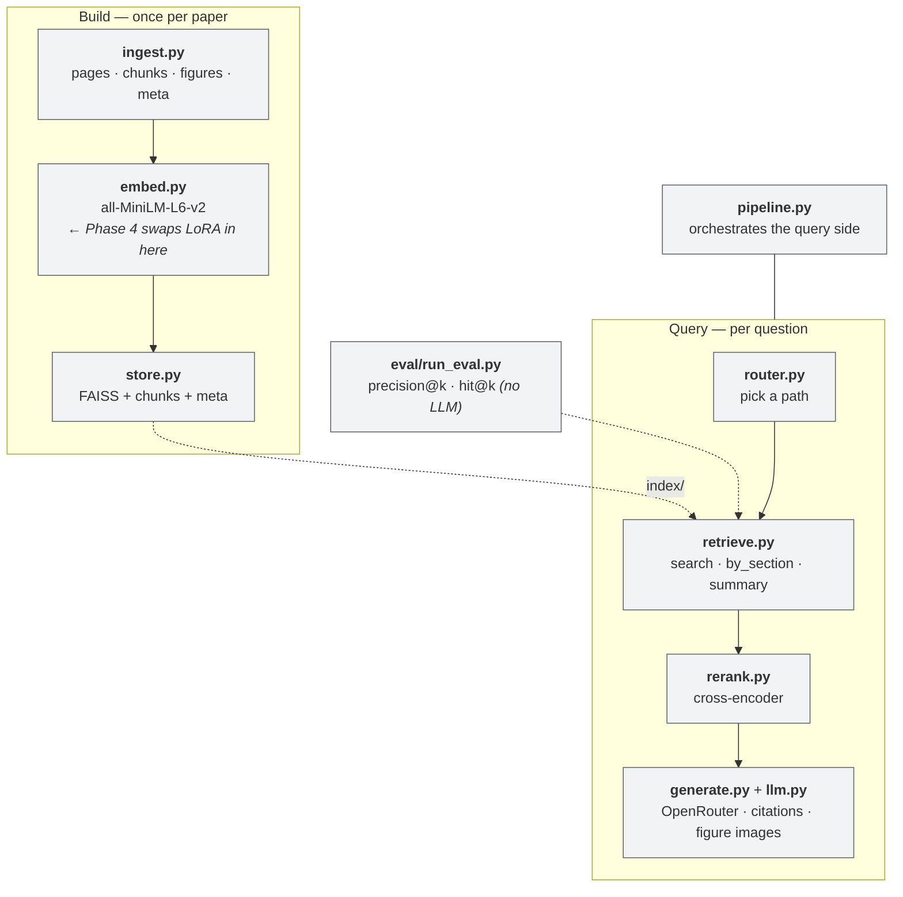
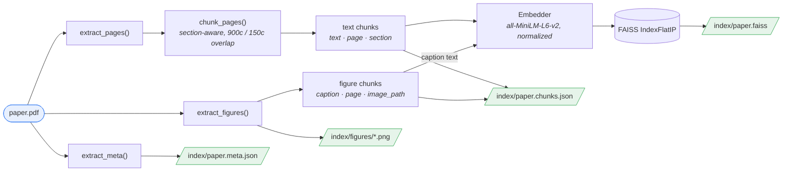
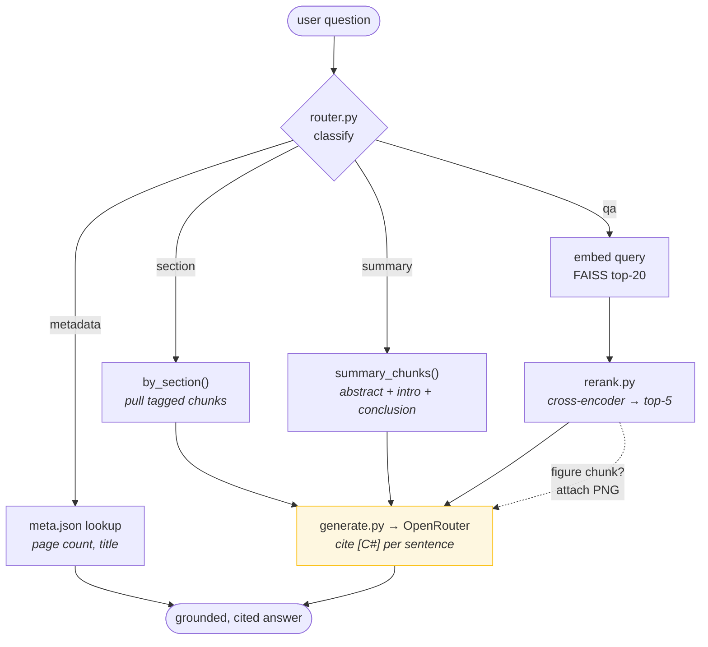
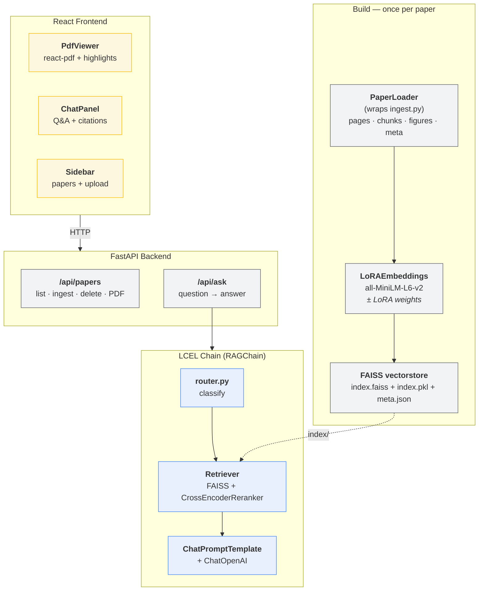

# Paper Q/A RAG LoRA

Upload one research paper, ask natural-language questions, get grounded, cited,
verified answers. Built phase by phase — each phase is independently demoable and
produces a number.

**Current status:** Phase 0–6 done. Text baseline RAG + eval harness, query
routing, cross-encoder reranking, multimodal figure+caption retrieval, LoRA
fine-tuned retriever, **LangChain LCEL pipeline**, **FastAPI backend**,
**React frontend** with PDF viewer + chunk highlighting, and **Docker**.
Generation runs on **Cloudflare Workers AI** (`@cf/mistralai/mistral-small-3.1-24b-instruct`).




Measured over **125 questions across 5 papers** (retrieval-only, no LLM):

| | hit@5 |
|---|---|
| baseline bi-encoder | 0.776 |
| + cross-encoder reranking | **0.928** (+20%) |
| + LoRA (trained on 6 *disjoint* papers) | **0.936** (+0.8%) |
| LoRA alone, no reranking | 0.856 (+10.3%) |

The interesting result isn't the headline — it's that **LoRA and reranking are
largely redundant**: both rescue the same failure mode, so LoRA's solid +10.3%
solo gain collapses to noise once reranking is in the stack. See the findings log.

## Phases

| Phase | What it adds | Where it lives | Status |
|-------|--------------|----------------|--------|
| 0 | Skeleton, config, eval scaffold | this repo | ✅ done |
| 1 | Text baseline: parse → chunk → embed → FAISS → LLM → eval | this repo | ✅ done |
| 1+ | Query router: metadata / section / summary / qa paths | `src/router.py` | ✅ done |
| 2 | Cross-encoder reranking | `src/rerank.py`, `src/retrieve.py` | ✅ done |
| 3 | Figures + captions, images to the LLM | `src/ingest.py`, `src/generate.py` | ✅ done |
| 4 | LoRA fine-tuned embedding model (trained on Colab) | `scripts/make_train.py`, `colab/train_lora.ipynb` | ✅ done |
| 5 | Streamlit UI, deploy to HF Spaces | `app_streamlit.py`, `DEPLOY.md` | ✅ done |
| 6 | LangChain + FastAPI + React + Docker | `src/lc/`, `api/`, `frontend/` | ✅ done |

## Tooling

- `scripts/fetch_papers.py` — pull open-access PDFs from arXiv (by id(s) or search).
- `scripts/make_eval.py` — generate a held-out eval set from a built index with
  the LLM; every gold snippet is verified as an exact substring of its chunk.
  One LLM call per paper, so growing the corpus is cheap.

## Web UI (Phase 5)

**Streamlit app** (`app.py`) — interactive querying. Run locally or deploy to HF Spaces.

```bat
.venv\Scripts\python.exe -m pip install -r requirements.txt -r requirements-app.txt
run_app.bat
:: visit http://localhost:8501
```

> **Use `run_app.bat`, not a bare `streamlit run app.py`.** If a global Python
> also has streamlit installed, `streamlit` on PATH resolves to *that*
> interpreter, which can't see this venv's packages. It gets far enough to open
> the page and then dies on `No module named 'torchvision'` (or `peft`) when a
> model loads — an error that looks like a missing install but isn't. The batch
> file pins `.venv\Scripts\python.exe -m streamlit`; the app also detects the
> case and names the offending interpreter instead of dumping a traceback.

**Deploy to Hugging Face Spaces** — see `DEPLOY.md` for step-by-step instructions.
Five minutes total: create a Space, copy files, push. It's live.

Features:
- Pick a paper from the sidebar
- Ask a question, get an answer with citations
- See retrieved chunks (text + figure images)
- View the route taken
- Reranking + LoRA + multimodal all work out of the box

### Query routes

The router (`src/router.py`) picks a path per question, because semantic search
alone can't serve every kind of query:

| Route | Example | Why not plain search |
|-------|---------|----------------------|
| `metadata` | "how many pages?" | not in the text at all |
| `metadata+text` | "who are the authors?" | on the title page; PDF metadata is unreliable |
| `section` | "what is the abstract?" | the word "abstract" doesn't appear in the abstract |
| `figure` | "what does Figure 3 show?" | a figure *number* carries almost no topical meaning |
| `summary` | "summarize this paper" | needs abstract+intro+conclusion, not top-k |
| `qa` | "how does self-attention work?" | the normal path |

### Managing papers

```bat
:: what's built
python -m scripts.remove_paper --list

:: remove one (deletes its index + figures; the PDF in data\ stays)
python -m scripts.remove_paper gpt3
```

Removing a paper that has an eval set is refused unless you pass `--force` —
dropping one silently changes what `run_eval` measures and makes the README's
before/after numbers non-reproducible.

### Chatting with a new paper

Two commands, then refresh the page — the app lists every built index, so a new
paper shows up on its own with no code change.

```bat
:: from arXiv (the id is in the URL: arxiv.org/abs/2005.14165)
python -m scripts.fetch_papers 2005.14165
python -m scripts.build_index data\2005.14165.pdf gpt3

:: or your own PDF -- drop it in data\ first
python -m scripts.build_index data\mypaper.pdf mypaper
```

The last argument is the index name shown in the dropdown. Building re-reads the
PDF, chunks it, extracts figures and embeds everything — roughly 10–60s depending
on length. Nothing else needs to be re-run: other papers are untouched.

### Eval corpus

Five ML/CV papers (one domain, per `phases.md` #4 — a coherent target for the
Phase 4 LoRA), one index each:

| Index | Paper | arXiv |
|-------|-------|-------|
| `imagenet` | ImageNet: A Large-Scale Hierarchical Image Database | (CVPR'09, local) |
| `transformer` | Attention Is All You Need | 1706.03762 |
| `resnet` | Deep Residual Learning for Image Recognition | 1512.03385 |
| `vgg` | Very Deep Convolutional Networks (VGG) | 1409.1556 |
| `bert` | BERT: Pre-training of Deep Bidirectional Transformers | 1810.04805 |

## Architecture

Small single-purpose modules; each phase adds or swaps exactly one.



| Module | Responsibility | Phase |
|--------|----------------|-------|
| `ingest.py` | PDF → text chunks, figure crops, doc metadata | 1, 3 |
| `embed.py` | Bi-encoder embeddings (the only thing Phase 4 fine-tunes) | 1, 4 |
| `store.py` | FAISS index + chunk/meta persistence | 1 |
| `router.py` | Classify query → metadata / section / summary / qa | 1+ |
| `retrieve.py` | Semantic search, section pull, summary gather | 1, 1+, 2 |
| `rerank.py` | Cross-encoder reorder of a wide candidate set | 2 |
| `llm.py` | OpenRouter transport (text + image parts, backoff) | 1, 3 |
| `generate.py` | Prompting, citation forcing, figure images | 1, 3 |
| `pipeline.py` | Route → retrieve → generate | 1 |

## Data flow

### Build time — `scripts/build_index.py` (run once per paper)



- **Section-aware chunking:** a regex tags each chunk with the last section header
  seen (Abstract, Introduction, Method, …) plus its page number.
- **Figures ride in the same index** — the *caption* is what gets embedded
  (captions are gold for retrieval); the rendered PNG is handed to Gemini later.
  A figure is the page region *above* its caption, bounded by prose. We render
  rather than extract embedded images — see the Phase 3 finding.
- Vectors are L2-normalized, so FAISS inner-product search == cosine similarity.
- On the ImageNet paper this yields **52 text chunks + 13 figures** over 8 pages.

### Query time — `src/pipeline.py`



| Route | Trigger | Why it exists |
|-------|---------|---------------|
| `metadata` | "how many pages", "who wrote this" | Not in the text at all — no retrieval can find it |
| `section` | "what is the abstract" | Structural query: its words don't overlap the target text |
| `summary` | "summarize the paper" | Whole-paper synthesis isn't a top-k lookup |
| `qa` | everything else | The normal semantic-search path (+ reranking) |

The router exists because plain semantic search matches on *topical content*, so
it misses **structural** questions whose words don't overlap the target text.
See the Phase 1+ finding below.

## Setup (Windows 11, CPU-only)

```bat
python -m venv .venv
.venv\Scripts\activate
pip install -r requirements.txt
copy .env.example .env
```

> `.env` is gitignored — it holds your API key. Never commit it.

Then fill in `.env`. Default provider is **Cloudflare Workers AI**:

```
LLM_PROVIDER=cloudflare
CLOUDFLARE_ACCOUNT_ID=<hex id>
CLOUDFLARE_API_TOKEN=<token>
```

- **Account ID** — dash.cloudflare.com → *Workers & Pages* → "Account ID" in the
  right sidebar (also the hex string in the dashboard URL after `/accounts/`).
- **API token** — dash.cloudflare.com/profile/api-tokens → *Create Token* →
  **Workers AI** template (permission: Account → Workers AI → Read).

### Why Cloudflare

| Provider | Free tier | Verdict |
|----------|-----------|---------|
| Cloudflare Workers AI | ~10k Neurons/day (thousands of calls) | **default** |
| OpenRouter | **50 requests/DAY, account-wide** across all free models | too tight |
| Gemini (`gemini-3.5-flash`) | ~20 requests/DAY | unusable |

OpenRouter's cap is per *account*, not per model — so rotating models does not
route around it. It couldn't carry the Phase 4 training-data step. Both providers
speak the OpenAI chat shape, so `src/llm.py` supports either via `LLM_PROVIDER`.

**Model choice matters:** generation must be **vision-capable** — Phase 3 sends
figure images and a text-only model drops them *silently*. `tencent/hy3:free`, for
example, is text-only.

Defaults: `@cf/mistralai/mistral-small-3.1-24b-instruct` (Cloudflare) /
`google/gemma-4-26b-a4b-it:free` (OpenRouter). Cloudflare's obvious vision picks
(`llama-3.2-11b-vision-instruct`, `moondream`) are **gated** behind a licence you
must accept yourself — including a representation that you're not EU-domiciled.
Mistral Small 3.1 is ungated, on the free plan, and reads charts fine, so the
project needs no licence click. Cloudflare lists it under *Text Generation*, but
it does accept images.

## Run

```bat
:: (optional) grab papers from arXiv, by id(s) or a search query
python -m scripts.fetch_papers 1706.03762 1512.03385

:: 1. build an index per paper (once per paper)
python -m scripts.build_index data\paper.pdf imagenet
python -m scripts.build_index data\1706.03762.pdf transformer

:: 2. ask it questions (interactive loop; Ctrl+C to quit)
python -m scripts.ask

:: 3. (optional) generate a held-out eval set per paper -- 1 LLM call each
python -m scripts.make_eval imagenet --n 25
python -m scripts.make_eval transformer --n 25

:: 4. measure retrieval quality across every paper (no LLM calls; free)
python -m eval.run_eval
set RERANK=0 & python -m eval.run_eval        :: baseline, no reranking
python -m eval.run_eval --refusal             :: also test refusals (uses LLM quota)
```

`run_eval` with no arguments picks up every `eval/eval_set_*.json`, groups the
questions by the paper they belong to, and reports per-paper **and** overall
metrics. The embedding and reranker models load once and are shared.

## Eval

`eval/run_eval.py` reports **precision@k**, **hit@k** (from the retriever only —
free, no LLM), and **refusal accuracy** (opt-in via `--refusal`, uses API quota).
A chunk counts as relevant if it contains any of an item's `gold_snippets`.
Run it before/after each phase — set `RERANK=0/1` to compare — to get a real delta.

`eval/eval_set_<index>.json` files are generated by `scripts/make_eval.py`: it asks
the LLM to write a question + verbatim answer snippet per chunk, then keeps only
snippets that are exact substrings of their chunk, so the relevance check is
sound. Each item carries an `index` field naming its paper — that's how one
`run_eval` spans the whole corpus.

Treat these as a *held-out eval* set only — **never reuse these pairs for LoRA
training** (`phases.md` #2). Phase 4 needs its own synthetic training triplets.

## Findings log

What we actually learned running each phase — the interview-story material.

### Eval corpus — generating eval sets that survive the LLM
- Asking for **one big JSON array** covering ~33 excerpts failed on 3 of 5 papers:
  `Unterminated string` (reply truncated), `Invalid control character` (snippets
  copied out of a PDF carry raw newlines), `Expecting ':' delimiter`. All-or-nothing
  parsing meant one bad row cost the entire paper.
- Fixes, in order of payoff: **(1)** batch ~8 excerpts per call so replies stay
  short enough not to truncate; **(2)** `json.loads(..., strict=False)` to tolerate
  the control characters; **(3)** on a parse failure, regex out the objects that
  *did* survive rather than dropping the batch.
- Validation deliberately runs **the exact substring test `run_eval` uses**, so a
  pair that passes generation cannot fail at eval time.

### Phase 1 — text-only baseline
- End-to-end RAG works on the ImageNet paper (Deng et al.): 52 chunks, 8 pages.
- Citation-forcing (`[C#]` per sentence) and the fixed refusal string both behave.
- Out-of-scope questions ("capital of France?") correctly refuse.

### Phase 1+ — query routing (the "why baselines lie" finding)
- **Symptom:** "What is the abstract of this paper?" and "How many pages is
  this?" both returned the refusal string, even though the abstract is chunk C0.
- **Root cause (measured):** semantic search embeds on *content*, so a structural
  query has almost no vocabulary overlap with its target. Retrieval scores for
  "what is the abstract" were 0.12–0.21 and pulled **References** chunks — the
  actual Abstract (C0) never entered the top-5. Page count isn't in the text at
  all, so it's unanswerable by content retrieval by construction.
- **Fix:** a lightweight rule-based router in front of retrieval —
  - *metadata* questions answer straight from `meta.json` (page count etc.),
  - *section* questions ("the abstract", "the conclusion") pull that section's
    chunks directly by their `section` tag,
  - *summary* questions feed abstract+intro+conclusion to the LLM,
  - everything else takes the normal semantic-search path.
- **Result:** all three broken cases now answer correctly; normal content
  questions (even ones containing section words like "results") still route to
  `qa` and are unaffected.
- **Takeaway:** not every question is a nearest-neighbour lookup. Cheap routing
  fixes a class of failures that more embedding horsepower (Phase 4) would not.

### Phase 2 — cross-encoder reranking
- Setup: `qa` path now fetches FAISS top-20, rescoring with
  `cross-encoder/ms-marco-MiniLM-L-6-v2`, keeps top-5. Toggle with env `RERANK`.
- **Measured on 125 questions across 5 papers** (retrieval-only, no LLM):

  | Paper | baseline hit@5 | + rerank hit@5 | Δ |
  |-------|----------------|----------------|---|
  | `bert` | 0.840 | 0.960 | +0.12 |
  | `imagenet` | 0.800 | 0.920 | +0.12 |
  | `resnet` | 0.760 | 0.960 | +0.20 |
  | `transformer` | 0.760 | 0.920 | +0.16 |
  | `vgg` | 0.720 | 0.880 | +0.16 |
  | **OVERALL (n=125)** | **0.776** | **0.928** | **+20%** |

  precision@5: **0.189 → 0.237** (+25%).

- **Reranking helps on every single paper** — that consistency across 5 independent
  documents is what makes this claim defensible; a one-paper win could be luck.
- Reranking recovers questions whose gold chunk sat in the top-20 candidate pool
  but below the bi-encoder's top-5; the cross-encoder pulls it up. That's the
  textbook reason two-stage retrieval works.
- **On reading precision@5:** each question has ~1 gold chunk, so the ceiling is
  ~0.2–0.4 by construction. 0.237 is near that ceiling, not "24% good". **hit@5**
  is the metric that means what you'd expect; the *delta* is the real story.
- Eval grew 15 → 25 (one paper) → **125 (five papers)**. At n=15 a single question
  moved hit@5 by 6.7% — too noisy to trust a delta.
- Earlier single-paper runs quoted different absolutes (e.g. imagenet 0.640) because
  the eval set was regenerated by a newer generator; **old and new numbers are not
  comparable.** The 125-question corpus is the baseline from here on.

### Phase 3 — figures + captions (multimodal)
- Approach (per the pragmatic plan): embed the **caption** for retrieval, hand the
  **rendered figure image** to Gemini at answer time. Figure chunks live in the
  same FAISS index as text, so no separate retrieval path is needed.
- **Don't extract embedded images.** Pages 3 and 6 of the ImageNet paper contain
  Figures 4, 8 and 9 but have *zero* image XObjects — those figures are vector
  plots. Meanwhile pages that do have XObjects carry 13–64 of them (fragments and
  logos). Rendering the page region above each caption gets the real figure in
  both cases; XObject extraction would have silently missed a third of them.
- **Caption regex: every new paper broke it a new way.** Three variants found so
  far, each of which silently produced **zero figures** for its paper:

  | Style | Example | Found in |
  |-------|---------|----------|
  | colon | `Figure 3: ...` | ImageNet, Transformer, VGG, BERT |
  | period | `Figure 3. ...` | ResNet (**0 → 21** figures) |
  | section-scoped | `Figure 1.1: ...` | GPT-3 (**0 → 41** figures) |

  Final pattern: `\d+(?:\.\d+)*\s*[.:]\s`. The discriminator against in-text refs
  ("Figure 1.2 illustrates …") is the **period/colon after the number** — a
  reference has only a space there, so it's still correctly rejected.
- The failure mode is what matters: a caption regex that matches nothing doesn't
  error, it just quietly produces a text-only index. **A rule tuned on one paper
  is not a rule** — and the only thing that ever caught it was indexing a paper
  from a different publisher.
- **The bug worth remembering:** the first cut clipped the crop at the nearest text
  block above the caption, and extracted only **2 of 13** figures. Figures are full
  of their own text — axis labels ("tree height"), subfigure markers ("(a) (b)"),
  legends — which sit directly above the caption and collapsed every crop to
  4–18pt, under the size floor. Fix: only **prose blocks (>200 chars) or another
  caption** bound a figure; short labels are part of it. → **13/13 extracted.**
- Verified end-to-end: "In Figure 9, how does average AUC change as tree height
  increases?" retrieves `F9` at rank 1, attaches the image, and Gemini answers
  from the chart citing `[F9]`.
- **Measured cost of going multimodal** — the 13 caption chunks compete with text
  for top-5 slots, on the same 25 text-question eval set:

  | Index | baseline hit@5 | + rerank hit@5 |
  |-------|----------------|----------------|
  | text only (Phase 2) | 0.680 | 0.920 |
  | + 13 figures (Phase 3) | 0.640 | **0.880** |

  ~1 question of 25 in both conditions — within noise, but a real tradeoff, and
  the reranking delta holds. Worth knowing that adding a modality is not free for
  the other modality's questions. A figure-question eval set (which this doesn't
  have yet) is what would show the upside.
- **Caption style doesn't generalize** — see the regex finding above; it cost
  ResNet all 21 of its figures until caught by building a second paper's index.
- **Figure ids restart at F0 per paper**, so a shared `index/figures/` let one
  paper overwrite another's images: `F0_p3.png` was claimed by transformer, vgg
  *and* bert. Nothing errored — the wrong figure would just be sent to the LLM,
  which would describe it confidently. Fixed by writing to `index/figures/<index>/`.
  Both this and the caption bug were **invisible with a single paper**; the corpus
  is what found them.
- **Gotcha found here (the most useful lesson in this repo):** the eval originally
  ran the *full* pipeline — an LLM call per question — and died mid-run on a
  `429 RESOURCE_EXHAUSTED`. The model then in use (`gemini-3.5-flash`) had a free
  tier of **~20 requests/day**.

  The fix wasn't a bigger quota, it was **noticing the eval didn't need an LLM at
  all**: `precision@k`/`hit@k` are computed from *retrieved chunks*, and retrieval
  is exactly what reranking (and later LoRA) changes. `run_eval` now calls only the
  retriever. That made the metrics free, faster, deterministic, and immune to
  provider outages — which is why the eval corpus could later grow to 5 papers
  without an API budget. Refusal-accuracy genuinely needs generation, so it sits
  behind `--refusal`.

  Generation later moved to OpenRouter entirely (see Notes); the eval never cared.

## Phase 4 — LoRA on Colab

The bi-encoder in `src/embed.py` is the only thing fine-tuned. Everything else
stays put.

### The rule that makes the number mean anything

**Train on different *papers* than you evaluate on** — not merely different
questions. Training on a paper you evaluate on teaches the embedder those exact
chunks, and the "gain" is memorisation. `scripts/make_train.py` refuses any index
that has an eval set, so this can't happen by accident.

| | Papers | Used for |
|---|---|---|
| **Eval** | `imagenet`, `transformer`, `resnet`, `vgg`, `bert` | the 125-question benchmark |
| **Train** | `tr_adam`, `tr_batchnorm`, `tr_densenet`, `tr_mobilenet`, `tr_vit`, `tr_efficientnet` | LoRA triplets only |

Both are ML/CV (one coherent domain, `phases.md` #4), and **disjoint**. The claim
becomes: *fine-tuned on 6 papers, improved retrieval on 5 unseen papers.*

**Hard negatives, not random ones.** A random chunk is trivially separable and
teaches nothing. For each query we search the paper's own index with the *current*
model and take the top-ranked chunk that isn't the answer — the confusion the
fine-tune actually has to fix.

### Round trip

```
                    train/triplets.jsonl
   this repo  ──────────────────────────────────►  Colab (T4)
                                                        │ LoRA + merge
   models/minilm-lora/  ◄───────────────────────  minilm-lora.zip
```

**1. Generate triplets locally** (LLM calls; training papers only):

```bat
python -m scripts.make_train tr_adam tr_batchnorm tr_densenet tr_mobilenet tr_vit tr_efficientnet --n 45
```

This is the one genuinely quota-hungry step (~7 calls per paper). Free tiers will
rate-limit partway through, so the script **saves after every paper** and skips
ones it can't finish — re-run later and the limits will have reset. A few hundred
triplets is plenty (`phases.md` #2).

**2. On Colab** — open `colab/train_lora.ipynb`, set **Runtime → T4 GPU**, and run
top to bottom. Upload `train/triplets.jsonl` when cell 2 asks. It trains the LoRA,
merges it into the base weights, and hands you `minilm-lora.zip`.

**3. Back here** — unzip so `models\minilm-lora\config.json` exists, then:

```bat
python -m scripts.rebuild_all           :: MUST re-index: the vectors changed
python -m eval.run_eval                 :: LoRA on   (after)
set LORA=0 & python -m eval.run_eval    :: base model (before)
```

`src/embed.py` picks up `models/minilm-lora/` automatically once it exists; `LORA=0`
forces the base model. **Re-indexing is not optional** — querying with a new
embedder against vectors built by the old one is meaningless.

The adapter is merged on Colab, so this repo never needs `peft` installed.

### Phase 4 — LoRA fine-tuned embeddings

Trained on **232 triplets from 6 papers** (Adam, BatchNorm, DenseNet, MobileNet,
ViT, EfficientNet) that are **disjoint from the 5 eval papers** — so this measures
generalisation, not memorisation. LoRA r=16 on `query/key/value`, ~1–2% of params,
4 epochs, ~8s on a T4.

| Config | precision@5 | hit@5 |
|--------|-------------|-------|
| base, no rerank | 0.189 | 0.776 |
| **LoRA, no rerank** | 0.208 | **0.856** (+10.3%) |
| base + rerank | 0.237 | 0.928 |
| **LoRA + rerank** | 0.240 | **0.936** (+0.8%) |

- **LoRA works: +10.3% hit@5 on unseen papers**, improving every one of the 5
  (bert .84→.88, imagenet .80→.84, resnet .76→.88, transformer .76→.88, vgg .72→.80).
- **But it's largely redundant with reranking.** Stacked on the cross-encoder it
  adds **+0.8% — a single question out of 125**, and per-paper only `vgg` moved
  (.88→.92); the other four are identical. That is noise, not a result.
- **Why:** both fix the same failure — *gold chunk present but below the top-5*.
  Reranking already rescues those, so there is little left for LoRA to win.
  `phases.md` #4 predicted the gain would be "small and noisy"; it was, once
  reranking was in the stack.
- **The honest takeaway:** reranking bought **+20% for zero training**; LoRA bought
  **+10% alone but ~nothing on top of it**. Ship reranking first. LoRA earns its
  place only if you can't afford a cross-encoder at query time — where it's free
  (the cost is at index time) while reranking costs latency on every query.

### Section tagging — three bugs behind one symptom
"What are the limitations?" returned text from the wrong section on a paper that
*has* a Limitations section. Three independent causes, each enough on its own:

- **Tagging and routing kept separate lists.** `ingest` stored the literal header
  text, so "Results" and "Result" became different sections while the router
  looked up only one — silently missing the other's chunks. Worse, `Limitations`
  was in neither list, so those chunks inherited the previous section. Both lists
  now come from `src/sections.py`, so they cannot drift.
- **Roman numerals weren't parsed.** IEEE papers number sections `VIII. LIMITATIONS`;
  the regex only handled arabic numbering, so *no* header in such a paper matched
  and every chunk inherited the first section. The roman part is deliberately
  case-**sensitive**: matched case-insensitively, `[IVXLC]+` also matches ordinary
  words, and "Civil results were mixed" parses as numeral "Civil" + section
  "results".
- **Prose was mistaken for headers.** Matching the section name alone meant the
  sentence "conclusions are drawn." — sitting directly under `VIII. LIMITATIONS` —
  registered as a Conclusion header and *overwrote it*. So the section was found
  and then immediately clobbered. A header now has to look like one: name alone,
  or an inline `Abstract—…`, or a short line whose remaining words are capitalised.

**Counting references** is metadata, not retrieval — you cannot count a
bibliography from the top-5 chunks. `ingest.count_references` counts entries at
build time, but **only for numeric bibliographies** (`[1] … [40]`) and only when
the numbers run contiguously, where the highest label *is* the count. Author-year
lists and alphanumeric keys (`[ADG+16]`) return None and the app says it can't
count them: the heuristics tried were wrong by a wide margin (43 vs ~60, and 144
vs ~88 by sweeping up appendix citations), and a confidently wrong number is
worse than admitting the limit.

### Phase 4 — the silent no-op
- **The bug that would have faked the whole result:** `sentence-transformers` saves
  a LoRA adapter with peft's `PeftModel` key names —
  `base_model.model.encoder.layer.0…lora_A.weight` — but loads it back into a plain
  `BertModel`, which expects `encoder.layer.0…lora_A.default.weight`. Keys that
  don't match are **silently re-initialised instead of erroring**, and a freshly
  initialised LoRA has `lora_B = 0`, so it contributes exactly zero. The model
  loads "fine" and is byte-for-byte the base model.
- Had we trusted it, `run_eval` would have returned precisely the baseline and the
  honest-looking conclusion would have been *"LoRA gave no improvement"* — a
  completely wrong finding produced by a working-looking pipeline.
- Caught by one cheap assertion: **cosine(LoRA, base) == 1.0 means dead adapter**.
  That check is now `scripts/check_lora.py`; the rename is `scripts/fix_adapter_keys.py`.
  Run `check_lora` after every retrain, before spending time on a rebuild.
- Once live, the adapter moved **in-domain** queries most and off-domain least
  (ML queries cos ≈ 0.987–0.993, "capital of France" 0.998) — the signature of
  domain adaptation rather than random drift.
- **Also worth knowing:** `model.add_adapter()` (ST's own integration) trains fine
  but leaves a plain `BertModel`, so `merge_and_unload()` doesn't exist; and
  assigning `get_peft_model(...)` onto `model[0].auto_model` silently doesn't
  stick in ST v5. Saving the adapter and letting ST load it is the supported path.
- **The index must be rebuilt per model.** Queries embedded by one model compared
  against vectors built by another is meaningless, so `LORA=0/1` has to wrap
  `rebuild_all` *and* `run_eval`, not just the eval.

## Phase 6 — LangChain + FastAPI + React + Docker

Phase 6 refactors the RAG pipeline to use **LangChain** (LCEL chains, custom
components), exposes it via **FastAPI**, replaces Streamlit with a **React
frontend** (PDF viewer with chunk highlighting), and containerizes with
**Docker**.

The resume story: *"I built it from scratch first to understand the fundamentals
(Phases 0–5), then refactored with production tooling (Phase 6)."*

### What changed

| Original (Phases 0–5) | Phase 6 (LangChain) | Why |
|---|---|---|
| `src/embed.py` — raw SentenceTransformer | `src/lc/embeddings.py` — custom `Embeddings` subclass | LoRA toggle + L2 normalization preserved inside LC interface |
| `src/store.py` — manual FAISS + JSON | `src/lc/store.py` — LangChain FAISS vectorstore | Built-in metadata filtering, docstore, standard API |
| `src/generate.py` — string-formatted prompts | `src/lc/prompts.py` — `ChatPromptTemplate` | Composable with LCEL chains |
| `src/llm.py` — raw HTTP + retry | `ChatOpenAI` (in chain.py) | Both providers are OpenAI-compatible |
| `src/pipeline.py` — manual if/elif | `src/lc/chain.py` — LCEL with route dispatch | Composable, debuggable, extensible |
| `app.py` — Streamlit UI | `frontend/` — React + Vite + react-pdf | PDF viewer with chunk highlighting |
| CLI scripts only | `api/` — FastAPI REST API | Backend/frontend separation |

**What was preserved** (custom code wrapped in LC interfaces, not replaced):
- `src/ingest.py` — section-aware chunking + figure extraction (used by `PaperLoader`)
- `src/router.py` — regex-based query classifier (used by `RAGChain`)
- `src/sections.py` — canonical section names (unchanged)
- The LoRA model-loading logic (inside `LoRAEmbeddings`)

### Architecture (Phase 6)



### LangChain component map

| Component | LangChain class | Custom? | Where |
|---|---|---|---|
| `LoRAEmbeddings` | `langchain_core.embeddings.Embeddings` | Yes — wraps SentenceTransformer + LoRA toggle | `src/lc/embeddings.py` |
| `PaperLoader` | `langchain_core.document_loaders.BaseLoader` | Yes — wraps ingest.py | `src/lc/loader.py` |
| Vectorstore | `langchain_community.vectorstores.FAISS` | No — standard LC FAISS | `src/lc/store.py` |
| Reranker | `CrossEncoderReranker` + `ContextualCompressionRetriever` | No — standard LC | `src/lc/chain.py` |
| Prompts | `ChatPromptTemplate` | No — standard LC | `src/lc/prompts.py` |
| LLM | `ChatOpenAI` (works for both Cloudflare + OpenRouter) | No — standard LC | `src/lc/chain.py` |
| Pipeline | `RAGChain` (custom class using LCEL internally) | Yes — route dispatch | `src/lc/chain.py` |

### FastAPI endpoints

| Method | Endpoint | What it does |
|--------|----------|--------------|
| `GET` | `/api/papers` | List all indexed papers with titles |
| `POST` | `/api/papers/ingest` | Upload a PDF, build the index |
| `DELETE` | `/api/papers/{name}` | Remove a paper's index |
| `GET` | `/api/papers/{name}/pdf` | Serve the PDF for the frontend viewer |
| `POST` | `/api/ask` | Ask a question, get an answer with citations + chunks |
| `POST` | `/api/arxiv/fetch` | Download a paper from arXiv by ID |

### React frontend

Three-panel layout: sidebar (paper list + upload) | PDF viewer (react-pdf with
chunk highlighting) | chat panel (Q&A with citations).

- **PDF viewer** uses `react-pdf` with `customTextRenderer` to highlight
  retrieved chunk text directly on the PDF pages
- **Chunk highlighting** — different colors per chunk, clicking a chunk scrolls
  the PDF to its page
- **Upload flow** — drag-and-drop PDF upload, auto-names the index
- **Dark mode** by default with glassmorphism design

### Running Phase 6

```bat
:: Backend (FastAPI)
run_api.bat
:: → http://localhost:8000  (API docs at /docs)

:: Frontend (React + Vite)
cd frontend
npm run dev
:: → http://localhost:5173  (proxies /api to :8000)

:: Or with Docker
docker-compose up
:: → frontend at http://localhost:3000, backend at http://localhost:8000
```

### Index format change

Phase 6 switches from flat files to subdirectories:

```
Before:  index/paper.faiss + index/paper.chunks.json + index/paper.meta.json
After:   index/paper/index.faiss + index/paper/index.pkl + index/paper/meta.json
```

`scripts/rebuild_all.py` discovers both formats and rebuilds into the new one.
The old flat files can be deleted after a successful rebuild.

### Eval numbers (Phase 6 verification)

The LangChain refactor must produce **identical retrieval metrics** — same
embeddings, same FAISS index, same cross-encoder. Any drift means the
migration broke something. eval numbers are updated after verification.

## Known gaps

Being honest about what the numbers do and don't show:

- **Eval questions are LLM-generated, not hand-written.** Snippets are verified as
  exact substrings, so the metric is *sound*, but the questions inherit the
  generator's phrasing habits and may be easier than real user questions.
  `phases.md` calls for ~30 hand-built pairs — worth doing before quoting these
  numbers anywhere.
- **precision@5 is capped ~0.2–0.4** by having ~1 gold chunk per question. Prefer
  hit@5, and prefer deltas over absolute values.
- **Refusal accuracy is unmeasured** — it needs LLM calls (`--refusal`) and free
  tiers are rate-limited upstream. Retrieval metrics deliberately need no LLM,
  which is why the corpus can grow without an API budget.
- **No figure-question eval.** Every eval question is text-based, so Phase 3's
  multimodal path is verified by hand but **not measured**. The figure work is
  evidenced by one spot-check, not a number.
- **Figure crops are heuristic.** A figure is the region above its caption bounded
  by prose; unusual layouts (side-by-side captions, figures *below* captions,
  full-page figures) will crop imperfectly.

## Notes

- First `build_index` run downloads the embedding model (~90MB) once; Phase 2 adds
  the cross-encoder (~90MB) on first query.
- **`RuntimeError: Cannot send a request, as the client has been closed`** — a bug
  in recent `huggingface_hub`/`httpx`: any network hiccup while it checks the Hub
  (it probes for a LoRA `adapter_config.json` even when the model is cached)
  surfaces as this instead of a retry. Two fixes: re-run the command, or once the
  models are cached, skip the network entirely:

  ```bat
  set HF_HUB_OFFLINE=1
  ```
- `torch` (pulled in by sentence-transformers) is a large install; that's expected.
- **Two different rate limits, and they need different answers.** *Transient
  upstream 429s* (`"temporarily rate-limited upstream"`) are per-provider and
  intermittent — `src/llm.py` tries each fallback model before sleeping, which
  routes around them. But OpenRouter's **50/day cap is account-wide across every
  free model**, so model fallback does *nothing* for it; that one is only solved
  by switching provider (Cloudflare) or buying credits. Don't confuse the two.
- **Every fallback model must also be vision-capable**, or figure questions
  quietly degrade depending on which model happened to answer.
- OpenRouter sometimes returns **HTTP 200 with an error body** (e.g. `"Upstream
  idle timeout exceeded"`), so `src/llm.py` checks the body, not just the status.
